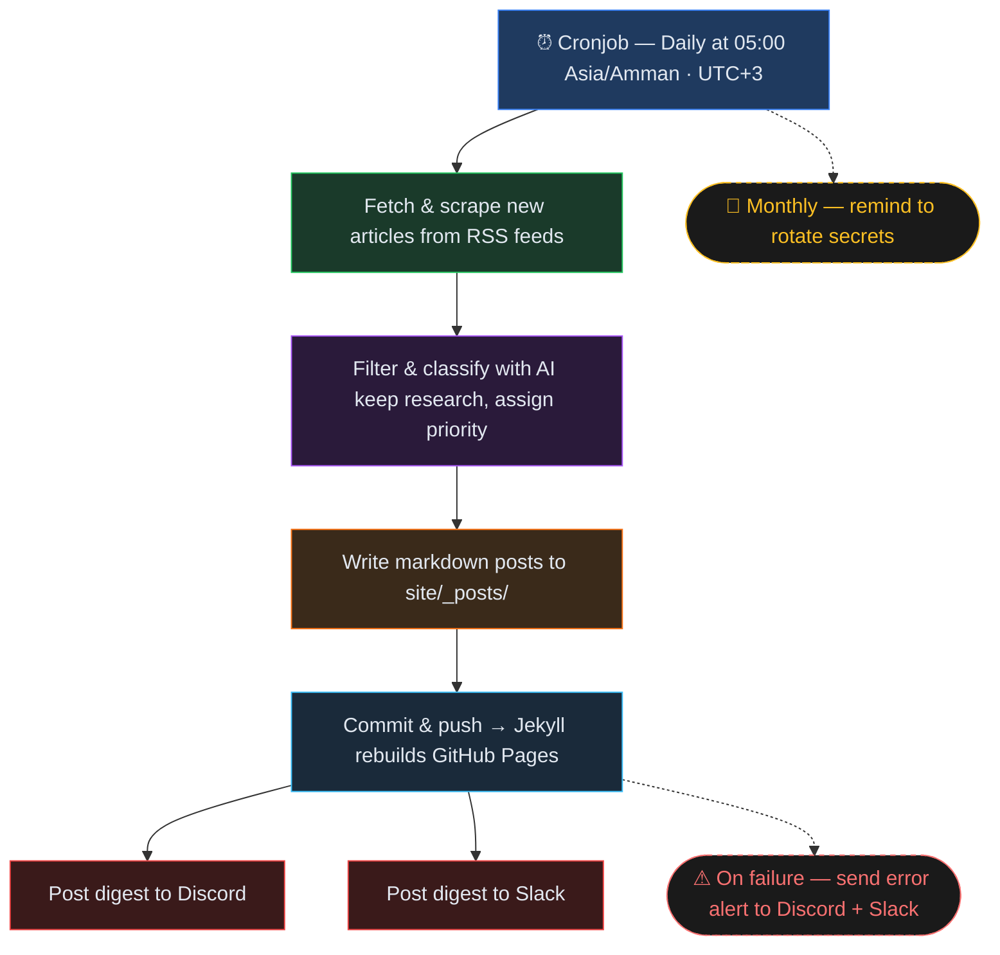

# Daily Security Feed

AI-curated security research feed — auto-updated daily, deployed to GitHub Pages. Supports **GitHub Copilot** or **Claude** as the AI classifier backend.

Fork this repo, add your feeds, and get your own daily security feed at `https://<you>.github.io/daily-security-feed/` with optional Discord/Slack notifications.

## Quick start

1. **Fork** this repository.
2. Delete `state/processed_urls.json` — it contains the upstream's seen URLs and will prevent your fork from fetching articles that were already processed here.
3. Enable **GitHub Pages** in your fork: `Settings → Pages → Source → GitHub Actions`.
4. Edit `feeds/feeds.yaml` with the RSS/Atom feeds you want to follow.
5. Add the required [secrets and variables](#setup).
6. Set up your AI backend — either [Copilot](#copilot-token-setup) or [Claude](#claude-api-setup).
7. Open **Actions** and run `daily-security-feed-bot` manually to seed the first batch.
8. Your site will be live at `https://<you>.github.io/daily-security-feed/` after the first run.

## How it works

## Setup

**Secrets** (`Settings → Secrets and variables → Actions → Secrets`):

| Secret | Required | Description |
| --- | --- | --- |
| `COPILOT_TOKEN` | If using Copilot | Fine-grained PAT with **Copilot Requests: Read** permission |
| `ANTHROPIC_API_KEY` | If using Claude | Anthropic API key |
| `DISCORD_WEBHOOK_URL` | No | Discord channel webhook for notifications |
| `SLACK_WEBHOOK_URL` | No | Slack incoming webhook for notifications |

**Variables** (`Settings → Secrets and variables → Actions → Variables`):

| Variable | Example | Description |
| --- | --- | --- |
| `CLASSIFIER_BACKEND` | `copilot` or `claude` | AI backend for classification (default: `copilot`) |
| `CLAUDE_MODEL` | `claude-sonnet-4-20250514` | Claude model ID — only used when backend is `claude` |
| `NOTIFY_CHANNELS` | `both`, `discord`, or `slack` | Where to send notifications (default: `both`) |
| `SKIP_CLASSIFY` | `true` or `false` | Skip AI classification — publish all fetched articles (default: `false`) |
| `PAGES_URL` | `https://you.github.io/daily-security-feed/` | GitHub Pages site URL — included as a "Browse feed" link in Discord and Slack notifications |

> [!NOTE]
> **Copilot** requires an active GitHub Copilot Pro subscription on the repo owner's account.
> **Claude** requires an Anthropic API key with sufficient credits.

## Copilot token setup

Create `COPILOT_TOKEN` as a fine-grained personal access token:

1. Go to GitHub `Settings` → `Developer settings` → `Fine-grained personal access tokens`.
2. Create a token for the account that owns the Copilot entitlement used by this pipeline.
3. Grant the minimum permission required: `Copilot Requests: Read`.
4. Set a short expiration date and store the token only in `Repo → Settings → Secrets and variables → Actions` as `COPILOT_TOKEN`.
5. Re-run the workflow after adding it to verify classification works.

Do not use a classic PAT here. Keep the token scoped only for Copilot requests.

## Claude API setup

To use Claude instead of Copilot:

1. Get an API key from the [Anthropic Console](https://console.anthropic.com/).
2. Add `ANTHROPIC_API_KEY` to `Repo → Settings → Secrets and variables → Actions → Secrets`.
3. Set the repo variable `CLASSIFIER_BACKEND` to `claude`.
4. Optionally set `CLAUDE_MODEL` to a specific model ID (default: `claude-sonnet-4-20250514`).
5. Re-run the workflow to verify classification works.

## Customization

| What | Where |
| --- | --- |
| Feed list | `feeds/feeds.yaml` — add/remove RSS/Atom URLs |
| Articles per run | `MAX_ARTICLES` env var (workflow default: 30) |
| Entries per feed | `ENTRIES_PER_FEED` env var (default: 5) |
| Max article age | `MAX_ARTICLE_AGE_DAYS` env var (default: 7) — skip entries older than this |
| AI system prompt | `prompts/classify.md` |
| Site theme | `site/_config.yml` and `site/_layouts/` |

## Security warning

Feed content is untrusted input. A malicious article can include indirect prompt-injection text that tries to coerce the classifier into revealing secrets or following attacker instructions.

1. Keep `COPILOT_TOKEN`, `ANTHROPIC_API_KEY`, `DISCORD_WEBHOOK_URL`, and `SLACK_WEBHOOK_URL` only in GitHub Actions secrets.
2. Use least-privilege credentials only. Do not reuse repo-admin, org-admin, or broadly scoped API tokens.
3. Rotate the Copilot PAT, Anthropic API key, and notification webhooks regularly.
4. Re-run the pipeline after rotation to verify the new secrets work.

## Security disclaimer

This project processes untrusted RSS/Atom content and passes it to an AI classifier. We implement multiple layers of defense against indirect prompt injection:

- **Pre-classifier scanning** (`pipeline/injection_scanner.py`) — a heuristic engine that normalises text through 8 layers (HTML entities, URL encoding, Unicode NFKD, zero-width characters, homoglyphs, leetspeak, base64 decoding) and matches against injection patterns in 14 languages before content ever reaches the AI. All prompt-interpolated fields (content, title, URL, feed, published date) are scanned. Articles that match are quarantined and never sent to the classifier.
- **In-prompt defenses** (`prompts/classify.md`) — explicit instructions telling the AI to treat all article content as data, never as instructions.
- **Output validation** — JSON extraction ignores non-JSON output from the classifier.
- **Input sanitization** — newlines and control characters are stripped from all fields before prompt interpolation.
- **Path traversal guards** — date fields used in filenames are validated against strict format patterns.
- **Least-privilege credentials** — the Copilot PAT is scoped to `Copilot Requests: Read` only; the Anthropic API key is used solely for classification requests.

> [!CAUTION]
> These defenses reduce risk but **do not guarantee complete protection**. Prompt injection is an open research problem with no known universal solution. By using this project, you acknowledge that:
>
> - No heuristic scanner can catch every possible injection technique. Adversaries may find bypasses.
> - AI models can behave unpredictably when processing adversarial input regardless of system prompt hardening.
> - The maintainers of this project provide these security measures on a best-effort basis and **accept no liability** for any damage, data exposure, credential leakage, or other harm arising from the use of this software.
> - You are responsible for securing your own secrets, tokens, and infrastructure.
>
> Use at your own risk. Review the code, scope your credentials tightly, rotate secrets regularly, and monitor your pipeline runs.

## Author & credits

Built and maintained by **Zeyad AbuLaban** ([@zAbuQasem](https://github.com/zAbuQasem) · [LinkedIn](https://www.linkedin.com/in/zeyad-abulaban/)).

If you fork or adapt this project, a link back is appreciated but not required.
